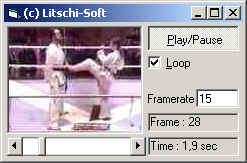



## The picture object \(stdole2\.tlb\)

### Description

How to use the picture object (stdole2.tlb) for animations.
 
### More Info
 

             |
---                |---
**Submitted On**   |2002-11-08 16:03:44
**By**             |[Harald Littschwager](https://github.com/Planet-Source-Code/PSCIndex/blob/master/ByAuthor/harald-littschwager.md)
**Level**          |Beginner
**User Rating**    |5.0 (20 globes from 4 users)
**Compatibility**  |VB 5\.0, VB 6\.0
**Category**       |[Graphics](https://github.com/Planet-Source-Code/PSCIndex/blob/master/ByCategory/graphics__1-46.md)
**World**          |[Visual Basic](https://github.com/Planet-Source-Code/PSCIndex/blob/master/ByWorld/visual-basic.md)
**Archive File**   |[The\_pictur14947711102002\.zip](https://github.com/Planet-Source-Code/harald-littschwager-the-picture-object-stdole2-tlb__1-40576/archive/master.zip)

